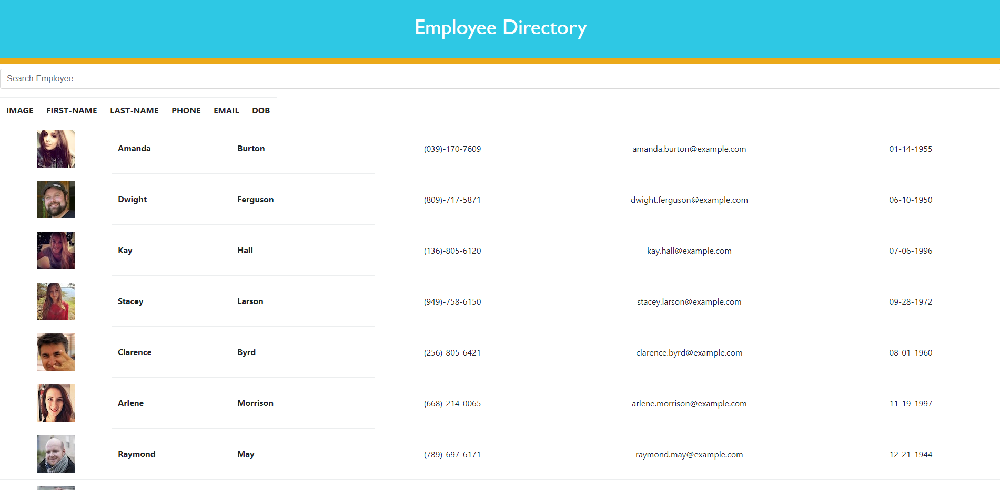

[](https://github.com/jones9682/Employee-Directory)
[](https://github.com/jones9682/Employee-Directory)
[](https://github.com/jones9682/Employee-Directory)

# **Employee Directory**

## Description

An app that you can view an entire employee directory at once and have quick access to their information.

```
As a business owner
An employee or manager would benefit greatly from being able to view non-sensitive data about other employees. It would be particularly helpful to be able to filter employees by name.
```

## Table of- Contents
- [Questions](#Questions)
- [Description](#Description)
- [License](#License)
- [Screen Capture](#Screen-Capture)
- [Repository Link](#Repository)
- [Contributors](#Contributors) 

## Screen Capture



## License

[](./LICENSE)

## Contributors
``
Bobby Jones Jr.
``
## Repository

- [Project Repo](https://github.com/jones9682/Employee-Directory)

## Questions


If you have any questions about the repo, open an issue or contact me directly at jones9682@yahoo.com. You can find more of my work at my [GitHub Profile](https://github.com/jones9682).
  
  
